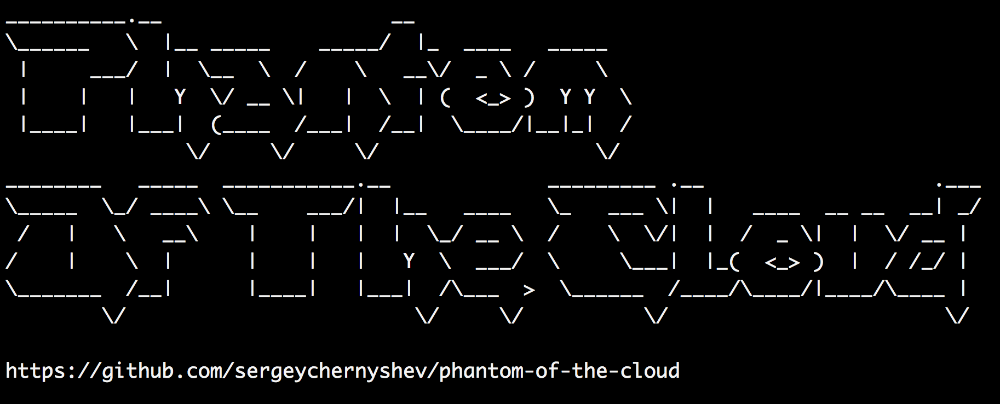

Phantom Of The Cloud
====================
v0.8.2 ([ami-c1d23aaa](https://console.aws.amazon.com/ec2/v2/home?region=us-east-1#Images:visibility=public-images;search=ami-c1d23aaa;sort=name))
--------------------

To use this Amazon AMI, just launch an instance and send following values within user data:

    git-repo: <url-to-git-repo>
    aws-key: <amazon-aws-security-key>
    aws-secret: <amazon-aws-secret>
    aws-region: us-east-1

During boot process, this image will clone the repo you specified under `/home/ec2-user/urser-repo` folder and will create `/home/ec2-user/system.ini` file with specified parameters so your app can read them later.

As alternative to `git-repo` you can use `tarball-repo` instead, your code will be downloaded and unpacked from the URL you provided.

You should also include at least one of these files as part of your repo:
* `/crontab` - crontab that will be installed for `ec2-user` user
* `/init.sh` - shell script that will be executed after repo is cloned
* `/supervisord/supervisord.conf` - [supervisord](http://supervisord.org/) config that will be installed in the system

This is how this image will know to start your apps.

Another useful configuration file:
* `/queue-cli.conf` - queue configuraton file for [enqueue and dequeue](https://github.com/sergeychernyshev/queue-cli) command line tools which will be copied to `/etc/queue-cli/queue-cli.conf`

Usually, your apps will be some kind of independent crawler or worker that will read data from Amazon SQS queue or SNS topic, do work and output results back into SQS/SNS or save to S3 or ping an external web service.

This allows you to spin up a bunch of instances to scale to high amount of work, you can utilize autoscaling groups based on group CPU usage or SQS queue lengh to scale your farm up and down.
